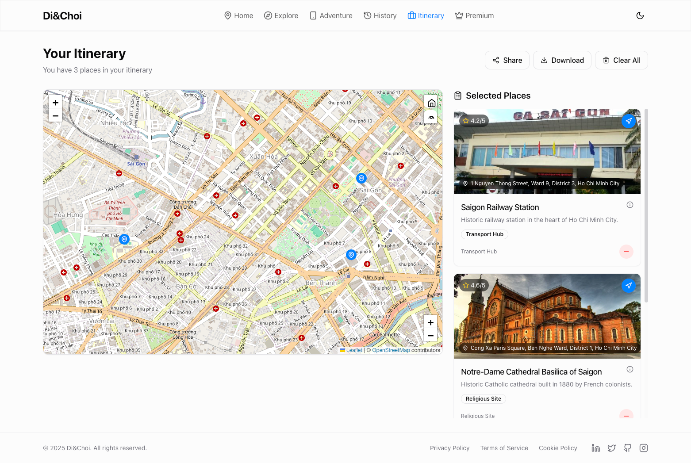

<h2 align="center">
    <a href="https://dainam.edu.vn/vi/khoa-cong-nghe-thong-tin">
    🎓 Faculty of Information Technology (DaiNam University)
    </a>
</h2>
<h2 align="center">
   XÂY DỰNG HỆ THỐNG PHẦN MỀM HỖ TRỢ KHÁCH DU LỊCH TỰ KHÁM PHÁ VÀ TRẢI NGHIỆM DU LỊCH QUA CHƯƠNG TRÌNH VẬN ĐỘNG. 
</h2>
</h2>

    

        
        
        
    

---

    <h2>Đề tài: Xây dựng hệ thống phần mềm hỗ trợ khách du lịch tự khám phá và trải nghiệm du lịch qua trò chơi vận động </h2>
    
 <h3>1. Giới thiệu hệ thống</h3>
    

      Trong bối cảnh doanh nghiệp hiện đại, ngành du lịch đang phát triển mạnh mẽ với sự hỗ trợ của công nghệ số, nhu cầu của khách du lịch ngày
 càng hướng tới các trải nghiệm tự do, tương tác và hấp dẫn. Đề tài này tập trung vào việc xây dựng một hệ thống phần mềm hỗ trợ khách du lịch tự khám phá
 và trải nghiệm du lịch thông qua trò chơi vận động.
    

    
 
Các chức năng chính:

    <ul style="font-size: 16px; line-height: 1.6;">
        <li>Đăng ký và đăng nhập tài khoản người dùng</li>
        <li>khám phá địa điểm qua bản đồ (tích hợp Leaflet và leaflet-routing machine) </li>
        <li>quét mã QR để xác thực checkpoint (sử dụng jsqr)</li>
        <li>quản lý lịch trình du lịch (Itinerary)</li>
        <li>theo dõi lịch sử chuyến đi (Travel History)</li>
        <li>hệ thống quiz cùng phần thưởng để tăng tính gamification.</li>
    </ul>

<h3>2. Ngôn ngữ và công nghệ chính</h3>

 
Ngôn ngữ lập trình: TypeScript, React, Vite, HTML, CSS  

    <ul style="font-size: 16px; line-height: 1.6;">
        <li>Công nghệ web Front-end:  SPA React + TypeScript, tập trung vào các pages và components</li>
        <li>Công nghệ web Back-end: Node.js server trong server/index.js, dùng module http. Dữ liệu lưu in-memory: checkpoints,visits.</li>
    </ul>
  

 
      

Công cụ hỗ trợ phát triển: 

    <ul style="font-size: 16px; line-height: 1.6;">
                                                   <li>Visual Studio Code: Trình soạn thảo mã nguồn chính, hỗ trợ cú pháp HTML, CSS, JavaScript.
                                                   <li> Google Chrome / Microsoft Edge: Trình duyệt dùng để chạy thử và kiểm tra giao diện website.
                                                   <li> GitHub: Dùng để lưu trữ và quản lý mã nguồn dự án trực tuyến. </li>

        
<h3>3. Hình ảnh các chức năng</h3>

    

         
         <i>Hình 1: Trang chủ<i>  
         
         <i>Hình 2: Các địa điểm được giới thiệu trong trang web<i>  
         
         <i>Hình 3: Các checkpoint(điểm đến) được mở khóa<i>  
         
         <i>Hình 4: Lịch sử <i>  
         
         <i>Hình 5: Quản lý lịch trình du lịch<i>  
         
         <i>Hình 6: Nạp tiền để tăng hiệu suất trải nghiệm<i>  
    

  

<h3>4. Hướng dẫn cài đặt và sử dụng ứng dụng</h3> 
**🔧Yêu cầu hệ thống**
- **Hệ điều hành**: Windows, macOS, hoặc Linux
- **Trình duyệt web**: Google Chrome, Microsoft Edge hoặc Firefox (phiên bản mới nhất).
- **Phần mềm hỗ trợ lập trình**: Visual Studio Code hoặc Node.js >=18.
- **Kết nối Internet**: Dùng để tải ảnh, thư viện CSS/JS

 **📦 Hướng dẫn sử dụng ứng dụng** 
 Cài đặt dependencies: Chạy npm install  để cài các package: react, typescript, vite, tailwindcss, leaflet, jsqr, @tanstack/react-query,
 react-router-dom, react-hook-form, zod, recharts, sonner, lucide-react, concurrently.   
 Chạy dev: npm run dev:all chạy song song frontend (Vite dev server)
 và backend (Node.js server/index.js) qua concurrently  

---
<h3>5. Liên hệ</h3>
<li>- Họ và tên: Đào Gia Hưng</li>
<li>- Lớp: CNTT 16-04</li>
<li>- Email: daogiahung222@gmail.com</li>
<li>- © 2025 ChuyenDoiSo, Faculty of Information Technology, DaiNam University. All rights reserved.</li>
---
